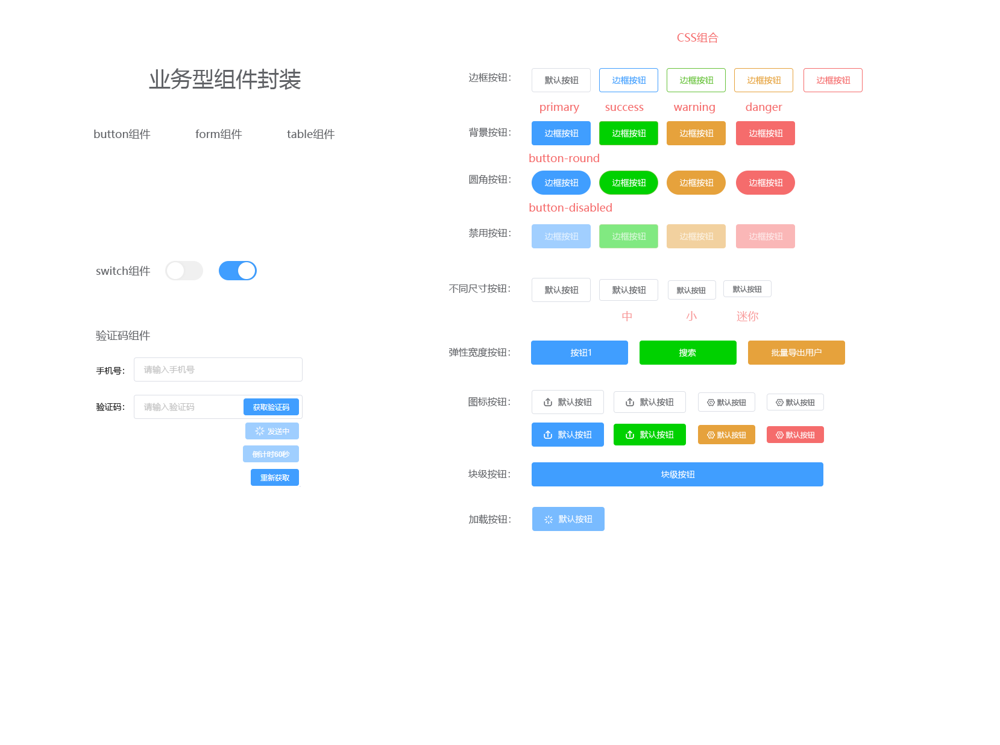
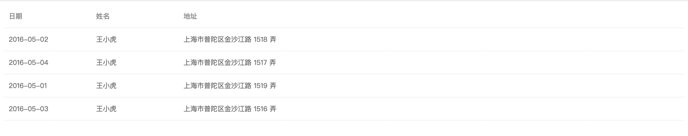
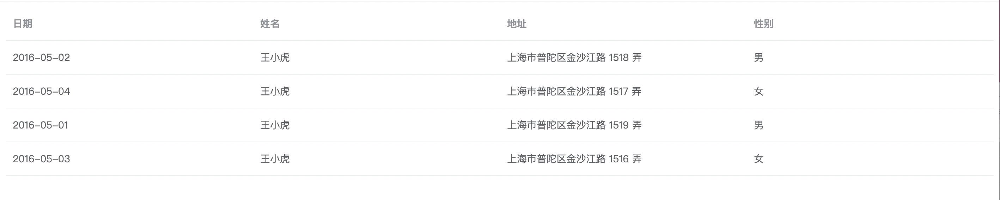
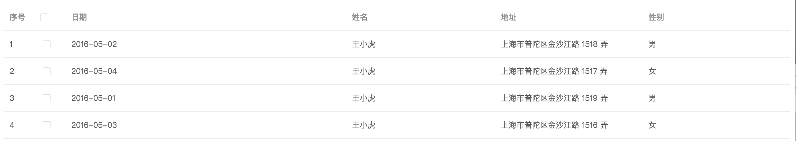
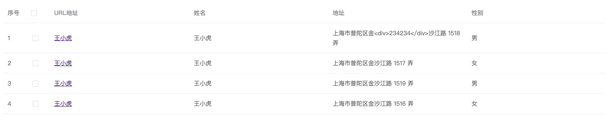
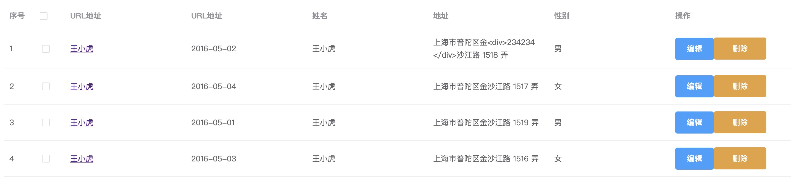
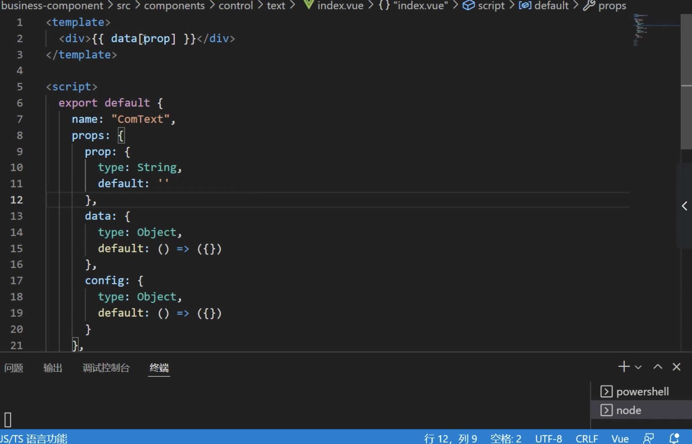
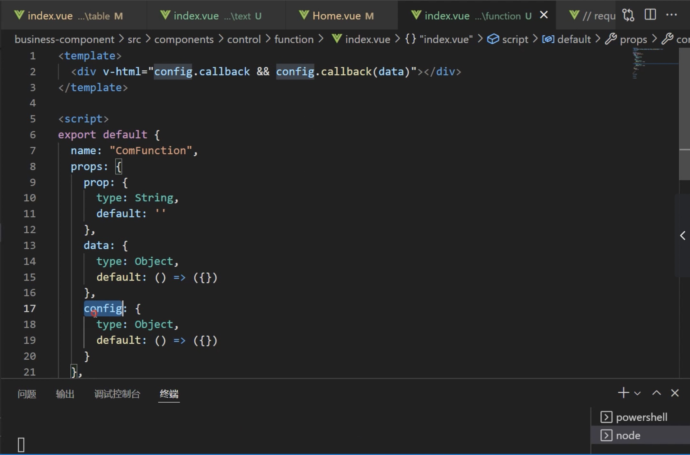

# component-project

## 封装业务组件库

### 一、button按钮组件封装

#### 1.1 button按钮介绍



#### 1.2 button组件封装 - 定义主题色

`component/button/index.vue`

```vue
<template>
  <button class="yang-button yang-button-warning">
    <slot></slot>
  </button>
</template>

<script>
export default {
  name: 'index'
}
</script>

<style lang="scss" scoped>
.yang-button{
  border-width : 1px;
  border-style: solid;
  border-color : #dcdfe6;
  height : 40px;
  padding : 0 20px;
  background-color: #fff;
  border-radius: 4px;
  font-size : 14px;
  color: #606266;
  cursor: pointer;
}
.yang-button-primary{
  background-color:#409eff;
  border-color : #409eff;
  color : #fff;
}
.yang-button-success{
  background-color:#00d100;
  border-color : #00d100;
  color : #fff;
}
.yang-button-danger{
  background-color : #e6a23c;
  border-color : #e6a23c;
  color : #fff;
}
.yang-button-warning{
  background-color:#f56c6c;
  border-color : #f56c6c;
  color : #fff;
}
</style>

```


#### 1.3 button组件封装 - 定义边框、圆角、禁用效果

`component/button/index.vue`

```vue
// template
<button disabled class="yang-button yang-button-primary is-round">
   <slot></slot>
</button>

// css
.yang-button[disabled]{
  cursor: not-allowed;
  opacity: 0.5;
}
```

#### 1.4 button组件封装 - type属性生成主题按钮

`views/home/index.vue`

```vue
<template>
  <div class="home">
    <yangButton>默认按钮</yangButton>
    <yangButton type="primary">成功按钮</yangButton>
    <yangButton type="danger">危险按钮</yangButton>
    <yangButton type="warning">警告按钮</yangButton>
  </div>
</template>

<script>

export default {
  name: 'Home',
  components: {
    yangButton: () => import('../components/button/index.vue')
  }
}
</script>

```

`component/button/index.vue`

```vue
<template>
  <button class="yang-button" :class="[theme]">
    <slot></slot>
  </button>
</template>

<script>
export default {
  name: 'index',
  props: {
    type: {
      type: String,
      default: ''
    }
  },
  computed: {
    theme () {
      return this.type ? `yang-button-${this.type}` : ''
    }
  }
}
</script>
```

#### 1.5 button组件封装 - border属性、round属性、disabled属性

`views/home/index.vue`

```vue
<template>
  <div class="home">
    <yangButton>默认按钮</yangButton>
    <yangButton type="primary" round disabled>成功按钮</yangButton>
    <yangButton type="danger" round border disabled>危险按钮</yangButton>
    <yangButton type="warning" border>警告按钮</yangButton>
  </div>
</template>

<script>

export default {
  name: 'Home',
  components: {
    yangButton: () => import('../components/button/index.vue')
  }
}
</script>

```

`component/button/index.vue`

```vue
<template>
  <button :disabled="disabled" class="yang-button" :class="[theme, isRound, isBorder]">
    <slot></slot>
  </button>
</template>

<script>
export default {
  name: 'index',
  props: {
    type: {
      type: String,
      default: ''
    },
    round: Boolean,
    border: Boolean,
    disabled: Boolean
  },
  computed: {
    theme () {
      return this.type ? `yang-button-${this.type}` : ''
    },
    isRound () {
      return this.round ? 'is-round' : ''
    },
    isBorder () {
      return this.border ? 'is-border' : ''
    }
  }
}
```

#### 1.6 button组件封装 - size属性

`views/home/index.vue`

```vue
<template>
  <div class="home">
    <yangButton>默认按钮</yangButton>
    <yangButton size="medium" type="primary" round disabled>成功按钮</yangButton>
    <yangButton size="small" type="danger" round border disabled>危险按钮</yangButton>
    <yangButton size="mini" type="warning" border>警告按钮</yangButton>
  </div>
</template>

<script>

export default {
  name: 'Home',
  components: {
    yangButton: () => import('../components/button/index.vue')
  }
}
</script>

```

`component/button/index.vue`

```vue
<template>
  <button :disabled="disabled" class="yang-button" :class="[theme, isRound, isBorder, isSize]">
    <slot></slot>
  </button>
</template>

<script>
export default {
  name: 'index',
  props: {
    type: {
      type: String,
      default: ''
    },
    size: {
      type: String,
      default: ''
    },
    round: Boolean,
    border: Boolean,
    disabled: Boolean
  },
  computed: {
    theme () {
      return this.type ? `yang-button-${this.type}` : ''
    },
    isRound () {
      return this.round ? 'is-round' : ''
    },
    isBorder () {
      return this.border ? 'is-border' : ''
    },
    isSize () {
      return this.size ? `yang-button-${this.size}` : ''
    }
  }
}
</script>

<style lang="scss" scoped>
.yang-button{
  border-width : 1px;
  border-style: solid;
  border-color : #dcdfe6;
  height : 40px;
  padding : 0 20px;
  background-color: #fff;
  border-radius: 4px;
  font-size : 14px;
  color: #606266;
  cursor: pointer;

  +.yang-button{
    margin-left : 14px;
  }
}
.yang-button-medium{
  height : 38px;
}
.yang-button-small{
  padding: 0 15px;
  height: 32px;
  font-size: 12px;
}
.yang-button-mini{
  padding: 0 15px;
  height: 28px;
  font-size: 12px;
}
.yang-button[disabled]{
  cursor: not-allowed;
  opacity: 0.5;
}
.yang-button-primary{
  background-color:#409eff;
  border-color : #409eff;
  color : #fff;
  &.is-border{
    background-color: transparent;
    color : #409eff;
  }
}
.yang-button-success{
  background-color:#00d100;
  border-color : #00d100;
  color : #fff;
  &.is-border{
    background-color: transparent;
    color :#00d100;
  }
}
.yang-button-danger{
  background-color : #e6a23c;
  border-color : #e6a23c;
  color : #fff;
  &.is-border{
    background-color: transparent;
    color : #e6a23c;
  }
}
.yang-button-warning{
  background-color:#f56c6c;
  border-color : #f56c6c;
  color : #fff;
  &.is-border{
    background-color: transparent;
    color :#f56c6c;
  }
}

/**
 * 圆角
 */
.is-round{border-radius: 100px;}
</style>

```


#### 1.7 button组件封装 - min-width弹性宽度

`views/home/index.vue`

```vue
<template>
  <div class="home">
    <yangButton>默认按钮</yangButton>
    <yangButton size="medium" type="primary" round disabled >a</yangButton>
    <yangButton size="small" type="danger" round border disabled>危险按钮</yangButton>
    <yangButton size="mini" type="warning" border>警告按钮</yangButton>
  </div>
</template>

<script>

export default {
  name: 'Home',
  components: {
    yangButton: () => import('../components/button/index.vue')
  }
}
</script>

```


`component/button/index.vue`

```vue
<template>
  <button :disabled="disabled" class="yang-button" :style="[minWidthCss]" :class="[theme, isRound, isBorder, isSize]">
    <slot></slot>
  </button>
</template>


props: {
    type: {
      type: String,
      default: ''
    },
    minWidth: {
      type: String,
      default: '95px'
    },
    size: {
      type: String,
      default: ''
    },
    round: Boolean,
    border: Boolean,
    disabled: Boolean
  },
  
minWidthCss () {
  if (!this.minWidth) return ''
  return { 'min-width': this.minWidth }
}
```


#### 1.8 button组件封装 - icon图标

`views/home/index.vue`

```vue
<template>
  <div class="home">
    <yangButton>默认按钮</yangButton>
    <yangButton size="medium" type="primary" >成功按钮</yangButton>
    <yangButton type="danger" >危险按钮</yangButton>
    <yangButton type="warning" border>警告按钮</yangButton>
  </div>
</template>

<script>

export default {
  name: 'Home',
  components: {
    yangButton: () => import('../components/button/index.vue')
  }
}
</script>

```

`component/button/index.vue`

```vue
<template>
  <button :disabled="disabled" class="yang-button" :style="[minWidthCss]" :class="[theme, isRound, isBorder, isSize]">
    <span>
      <i v-if="prefix" class="iconfont icon-prefix" :class="iconPrefix"></i>
        <slot></slot>
      <i v-if="suffix" class="iconfont icon-suffix" :class="iconSuffix"></i>
    </span>
  </button>
</template>

<script>
export default {
  name: 'index',
  props: {
    type: {
      type: String,
      default: ''
    },
    minWidth: {
      type: String,
      default: '95px'
    },
    size: {
      type: String,
      default: ''
    },
    prefix: {
      type: String,
      default: ''
    },
    suffix: {
      type: String,
      default: ''
    },
    round: Boolean,
    border: Boolean,
    disabled: Boolean
  },
  computed: {
    theme () {
      return this.type ? `yang-button-${this.type}` : ''
    },
    isRound () {
      return this.round ? 'is-round' : ''
    },
    isBorder () {
      return this.border ? 'is-border' : ''
    },
    isSize () {
      return this.size ? `yang-button-${this.size}` : ''
    },
    minWidthCss () {
      if (!this.minWidth) return ''
      return { 'min-width': this.minWidth }
    },
    iconPrefix () {
      return this.prefix ? `icon-${this.prefix}` : ''
    },
    iconSuffix () {
      return this.suffix ? `icon-${this.suffix}` : ''
    }
  }
}
</script>

<style lang="scss" scoped>
.yang-button{
  border-width : 1px;
  border-style: solid;
  border-color : #dcdfe6;
  height : 40px;
  padding : 0 20px;
  background-color: #fff;
  border-radius: 4px;
  font-size : 14px;
  color: #606266;
  cursor: pointer;

  + .yang-button{
    margin-left : 14px;
  }

  > span{
    display: inline-flex;
    align-items: center;
    justify-content: center;
  }

  .icon-prefix { margin-right: 10px; }
  .icon-suffix { margin-left: 10px; }
}
.yang-button-medium{
  height : 38px;
}
.yang-button-small{
  padding: 0 15px;
  height: 32px;
  font-size: 12px;
}
.yang-button-mini{
  padding: 0 15px;
  height: 28px;
  font-size: 12px;
}
.yang-button[disabled]{
  cursor: not-allowed;
  opacity: 0.5;
}
.yang-button-primary{
  background-color:#409eff;
  border-color : #409eff;
  color : #fff;
  &.is-border{
    background-color: transparent;
    color : #409eff;
  }
}
.yang-button-success{
  background-color:#00d100;
  border-color : #00d100;
  color : #fff;
  &.is-border{
    background-color: transparent;
    color :#00d100;
  }
}
.yang-button-danger{
  background-color : #e6a23c;
  border-color : #e6a23c;
  color : #fff;
  &.is-border{
    background-color: transparent;
    color : #e6a23c;
  }
}
.yang-button-warning{
  background-color:#f56c6c;
  border-color : #f56c6c;
  color : #fff;
  &.is-border{
    background-color: transparent;
    color :#f56c6c;
  }
}

/**
 * 圆角
 */
.is-round{border-radius: 100px;}
</style>

```

#### 1.9 button组件封装 - 块级元素

`views/home/index.vue`

```vue
<template>
  <div class="home">
    <yangButton block>默认按钮</yangButton>
    <yangButton size="medium" type="primary" block >成功按钮</yangButton>
    <yangButton type="danger" block>危险按钮</yangButton>
    <yangButton type="warning" border block>警告按钮</yangButton>
  </div>
</template>

<script>

export default {
  name: 'Home',
  components: {
    yangButton: () => import('../components/button/index.vue')
  }
}
</script>

```

`component/button/index.vue`

```vue
<template>
  <button :disabled="disabled" class="yang-button" :style="[minWidthCss]" :class="[theme, isRound, isBorder, isSize, blockCss]">
    <span>
      <i v-if="prefix" class="iconfont icon-prefix" :class="iconPrefix"></i>
        <slot></slot>
      <i v-if="suffix" class="iconfont icon-suffix" :class="iconSuffix"></i>
    </span>
  </button>
</template>

<script>
export default {
  name: 'index',
  props: {
    type: {
      type: String,
      default: ''
    },
    minWidth: {
      type: String,
      default: '95px'
    },
    size: {
      type: String,
      default: ''
    },
    prefix: {
      type: String,
      default: ''
    },
    suffix: {
      type: String,
      default: ''
    },
    round: Boolean,
    border: Boolean,
    disabled: Boolean,
    block: Boolean
  },
  computed: {
    theme () {
      return this.type ? `yang-button-${this.type}` : ''
    },
    isRound () {
      return this.round ? 'is-round' : ''
    },
    isBorder () {
      return this.border ? 'is-border' : ''
    },
    isSize () {
      return this.size ? `yang-button-${this.size}` : ''
    },
    minWidthCss () {
      if (!this.minWidth) return ''
      return { 'min-width': this.minWidth }
    },
    iconPrefix () {
      return this.prefix ? `icon-${this.prefix}` : ''
    },
    iconSuffix () {
      return this.suffix ? `icon-${this.suffix}` : ''
    },
    blockCss () {
      return this.block ? 'yang-button-block' : ''
    }
  }
}
</script>

<style lang="scss" scoped>
.yang-button{
  border-width : 1px;
  border-style: solid;
  border-color : #dcdfe6;
  height : 40px;
  padding : 0 20px;
  background-color: #fff;
  border-radius: 4px;
  font-size : 14px;
  color: #606266;
  cursor: pointer;

  + .yang-button{
    margin-left : 14px;
    margin-bottom: 10px;
  }

  > span{
    display: inline-flex;
    align-items: center;
    justify-content: center;
  }

  .icon-prefix { margin-right: 10px; }
  .icon-suffix { margin-left: 10px; }
}
.yang-button-medium{
  height : 38px;
}
.yang-button-small{
  padding: 0 15px;
  height: 32px;
  font-size: 12px;
}
.yang-button-mini{
  padding: 0 15px;
  height: 28px;
  font-size: 12px;
}
.yang-button[disabled]{
  cursor: not-allowed;
  opacity: 0.5;
}
.yang-button-primary{
  background-color:#409eff;
  border-color : #409eff;
  color : #fff;
  &.is-border{
    background-color: transparent;
    color : #409eff;
  }
}
.yang-button-success{
  background-color:#00d100;
  border-color : #00d100;
  color : #fff;
  &.is-border{
    background-color: transparent;
    color :#00d100;
  }
}
.yang-button-danger{
  background-color : #e6a23c;
  border-color : #e6a23c;
  color : #fff;
  &.is-border{
    background-color: transparent;
    color : #e6a23c;
  }
}
.yang-button-warning{
  background-color:#f56c6c;
  border-color : #f56c6c;
  color : #fff;
  &.is-border{
    background-color: transparent;
    color :#f56c6c;
  }
}

/*** 圆角 */
.is-round{border-radius: 100px;}
/**块级按钮*/
.yang-button-block{
  display: block;
  width: 100%;
  padding: 0;
  margin-bottom: 0;
}

</style>

```

#### 1.10 button组件封装 - loading加载

`views/home/index.vue`

```vue
<template>
  <div class="home">
    <yangButton >默认按钮</yangButton>
    <yangButton disabled :loading="flag" @click="handleSubmit" size="medium" type="primary"  >成功按钮</yangButton>
    <yangButton type="danger" >危险按钮</yangButton>
    <yangButton type="warning" >警告按钮</yangButton>
  </div>
</template>

<script>

export default {
  name: 'Home',
  data () {
    return {
      flag: false
    }
  },
  components: {
    yangButton: () => import('../components/button/index.vue')
  },
  methods: {
    handleSubmit () {
      this.flag = true
      setTimeout(() => {
        console.log('123')
        this.flag = false
      }, 3000)
    }
  }
}
</script>

```

`component/button/index.vue`

```vue
<template>
  <button @click="change" :disabled="disabled || loading " class="yang-button" :style="[minWidthCss]" :class="[theme, isRound, isBorder, isSize, blockCss]">
    <span>
      <i v-if="loading"  class="iconfont icon-prefix icon-loading"></i>
      <i v-if="prefix" class="iconfont icon-prefix" :class="iconPrefix"></i>
        <slot></slot>
      <i v-if="suffix" class="iconfont icon-suffix" :class="iconSuffix"></i>
    </span>
  </button>
</template>

<script>
export default {
  name: 'index',
  props: {
    type: {
      type: String,
      default: ''
    },
    minWidth: {
      type: String,
      default: '95px'
    },
    size: {
      type: String,
      default: ''
    },
    prefix: {
      type: String,
      default: ''
    },
    suffix: {
      type: String,
      default: ''
    },
    round: Boolean,
    border: Boolean,
    disabled: Boolean,
    block: Boolean,
    loading: Boolean
  },
  computed: {
    theme () {
      return this.type ? `yang-button-${this.type}` : ''
    },
    isRound () {
      return this.round ? 'is-round' : ''
    },
    isBorder () {
      return this.border ? 'is-border' : ''
    },
    isSize () {
      return this.size ? `yang-button-${this.size}` : ''
    },
    minWidthCss () {
      if (!this.minWidth) return ''
      return { 'min-width': this.minWidth }
    },
    iconPrefix () {
      return this.prefix ? `icon-${this.prefix}` : ''
    },
    iconSuffix () {
      return this.suffix ? `icon-${this.suffix}` : ''
    },
    blockCss () {
      return this.block ? 'yang-button-block' : ''
    }
  },
  methods: {
    change () {
      this.$emit('click')
    }
  }
}
</script>

<style lang="scss" scoped>
.yang-button{
  border-width : 1px;
  border-style: solid;
  border-color : #dcdfe6;
  height : 40px;
  padding : 0 20px;
  background-color: #fff;
  border-radius: 4px;
  font-size : 14px;
  color: #606266;
  cursor: pointer;

  + .yang-button{
    margin-left : 14px;
    margin-bottom: 10px;
  }

  > span{
    display: inline-flex;
    align-items: center;
    justify-content: center;
  }

  .icon-prefix { margin-right: 10px; }
  .icon-suffix { margin-left: 10px; }
}
.yang-button-medium{
  height : 38px;
}
.yang-button-small{
  padding: 0 15px;
  height: 32px;
  font-size: 12px;
}
.yang-button-mini{
  padding: 0 15px;
  height: 28px;
  font-size: 12px;
}
.yang-button[disabled]{
  cursor: not-allowed;
  opacity: 0.5;
}
.yang-button-primary{
  background-color:#409eff;
  border-color : #409eff;
  color : #fff;
  &.is-border{
    background-color: transparent;
    color : #409eff;
  }
}
.yang-button-success{
  background-color:#00d100;
  border-color : #00d100;
  color : #fff;
  &.is-border{
    background-color: transparent;
    color :#00d100;
  }
}
.yang-button-danger{
  background-color : #e6a23c;
  border-color : #e6a23c;
  color : #fff;
  &.is-border{
    background-color: transparent;
    color : #e6a23c;
  }
}
.yang-button-warning{
  background-color:#f56c6c;
  border-color : #f56c6c;
  color : #fff;
  &.is-border{
    background-color: transparent;
    color :#f56c6c;
  }
}

/*** 圆角 */
.is-round{border-radius: 100px;}
/**块级按钮*/
.yang-button-block{
  display: block;
  width: 100%;
  padding: 0;
  margin-bottom: 0;
}
/**loading动画加载*/
.icon-loading{
  animation: loading 2s infinite linear;
}

@keyframes loading {
  0% {
    transform: rotate(0deg);
  }
  100% {
    transform: rotate(360deg);
  }
}
</style>

```


#### 1.11 button组件封装 - 自定义主题颜色

1. 在styles文件内定义全局scss配置文件
2. 在内部定义的变量可以覆盖组件内相同名称的变量
3. 在vue.config.js内进行配置,进行scss配置文件的全局加载

`vue.config.js`

```javascript
/**
 * @author YangLing
 * @date 2022/7/18 11:17
 */
module.exports = {
  devServer: {
    port: 9999
  },
  css: {
    loaderOptions: {
      scss: {
        prependData: "@import './src/styles/scssconfig.scss';"
      }
    }
  }
}
```


### 二、table组件封装

#### 2.1 table组件封装 - 初始table组件

`components/table/index.vue`

```vue
<template>
  <div>
    <el-table
      :data="tableData"
      style="width: 100%">
      <el-table-column prop="date" label="日期" width="180"></el-table-column>
      <el-table-column prop="name" label="姓名" width="180"></el-table-column>
      <el-table-column prop="address" label="地址"></el-table-column>
    </el-table>
  </div>
</template>

<script>
export default {
  name: 'Table',
  data () {
    return {
      tableData: [{
        date: '2016-05-02',
        name: '王小虎',
        address: '上海市普陀区金沙江路 1518 弄'
      }, {
        date: '2016-05-04',
        name: '王小虎',
        address: '上海市普陀区金沙江路 1517 弄'
      }, {
        date: '2016-05-01',
        name: '王小虎',
        address: '上海市普陀区金沙江路 1519 弄'
      }, {
        date: '2016-05-03',
        name: '王小虎',
        address: '上海市普陀区金沙江路 1516 弄'
      }]
    }
  }
}
</script>

<style scoped>

</style>

```

`views/home.vue`

```vue
<template>
  <div class="home">
    <yang-table></yang-table>
  </div>
</template>

<script>

export default {
  name: 'Home',
  data () {
    return {
      flag: false
    }
  },
  components: {
    yangTable: () => import('../components/table/index.vue')
  },
  methods: {

  }
}
</script>

```

**实现效果:**



#### 2.2 table组件封装 - 定义数据配置表头

`views/home.vue`

```vue
<template>
  <div class="home">
    <yang-table :column="column"></yang-table>
  </div>
</template>

<script>

export default {
  name: 'Home',
  data () {
    return {
      column: [
        { label: '日期', prop: 'date' },
        { label: '姓名', prop: 'name' },
        { label: '地址', prop: 'address' },
        { label: '性别', prop: 'sex' }
      ]
    }
  },
  components: {
    yangTable: () => import('../components/table/index.vue')
  },
  methods: {

  }
}
</script>

```

`components/table/index.vue`

```vue
<template>
  <div>
    <el-table
      :data="tableData"
      style="width: 100%">
      <el-table-column v-for="item in column" :key="item.prop" :prop="item.prop" :label="item.label"></el-table-column>
    </el-table>
  </div>
</template>

<script>
export default {
  name: 'Table',
  props: {
    column: {
      type: Array,
      default: () => []
    }
  },
  data () {
    return {
      tableData: [{
        date: '2016-05-02',
        name: '王小虎',
        address: '上海市普陀区金沙江路 1518 弄',
        sex: '男'
      }, {
        date: '2016-05-04',
        name: '王小虎',
        address: '上海市普陀区金沙江路 1517 弄',
        sex: '女'
      }, {
        date: '2016-05-01',
        name: '王小虎',
        address: '上海市普陀区金沙江路 1519 弄',
        sex: '男'
      }, {
        date: '2016-05-03',
        name: '王小虎',
        address: '上海市普陀区金沙江路 1516 弄',
        sex: '女'
      }]
    }
  }
}
</script>

<style scoped>

</style>

```

**实现效果:**



#### 2.3 table组件封装 - 复选框、索引、宽度属性配置

`views/home.vue`

```vue
<template>
  <div class="home">
    <yang-table :column="column" checkbox index></yang-table>
  </div>
</template>

<script>

export default {
  name: 'Home',
  data () {
    return {
      column: [
        { label: '日期', prop: 'date', width: 500 },
        { label: '姓名', prop: 'name' },
        { label: '地址', prop: 'address' },
        { label: '性别', prop: 'sex' }
      ]
    }
  },
  components: {
    yangTable: () => import('../components/table/index.vue')
  },
  methods: {

  }
}
</script>

```

`components/table/index.vue`

```vue
<template>
  <div>
    <el-table
      :data="tableData"
      style="width: 100%">
      <el-table-column v-if="index" label="序号" type="index" width="55"></el-table-column>
      <el-table-column v-if="checkbox" type="selection" width="55"></el-table-column>
      <el-table-column v-for="item in column" :key="item.prop" :prop="item.prop" :label="item.label" :width="item.width"></el-table-column>
    </el-table>
  </div>
</template>

<script>
export default {
  name: 'Table',
  props: {
    column: {
      type: Array,
      default: () => []
    },
    checkbox: Boolean,
    index: Boolean
  },
  data () {
    return {
      tableData: [{
        date: '2016-05-02',
        name: '王小虎',
        address: '上海市普陀区金沙江路 1518 弄',
        sex: '男'
      }, {
        date: '2016-05-04',
        name: '王小虎',
        address: '上海市普陀区金沙江路 1517 弄',
        sex: '女'
      }, {
        date: '2016-05-01',
        name: '王小虎',
        address: '上海市普陀区金沙江路 1519 弄',
        sex: '男'
      }, {
        date: '2016-05-03',
        name: '王小虎',
        address: '上海市普陀区金沙江路 1516 弄',
        sex: '女'
      }]
    }
  }
}
</script>

<style scoped>

</style>

```

**实现效果:**



#### 2.4 table组件封装 - 自定义渲染文本

`views/home.vue`

```vue
<template>
  <div class="home">
    <yang-table :column="column" checkbox index></yang-table>
  </div>
</template>

<script>

export default {
  name: 'Home',
  data () {
    return {
      column: [
        {
          label: 'URL地址',
          type: 'function',
          prop: 'date',
          callback: (data) => {
            return `<a href="https://www.baidu.com">${data.name}</a>`
          }
        },
        // { label: '日期', prop: 'date', width: 500 },
        { label: '姓名', prop: 'name' },
        { label: '地址', prop: 'address' },
        { label: '性别', prop: 'sex' }
      ]
    }
  },
  components: {
    yangTable: () => import('../components/table/index.vue')
  },
  methods: {

  }
}
</script>

```

`components/table/index.vue`

```vue
<template>
  <div>
    <el-table
      :data="tableData"
      style="width: 100%">
      <el-table-column v-if="index" label="序号" type="index" width="55"></el-table-column>
      <el-table-column v-if="checkbox" type="selection" width="55"></el-table-column>
      <template v-for="(item) in column">
        <el-table-column v-if="item.type === 'function'" :key="item.prop" :prop="item.prop" :label="item.label" :width="item.width">
          <template v-slot="scope">
            <div v-html="item.callback && item.callback(scope.row)"></div>
          </template>
        </el-table-column>
        <el-table-column v-else  :key="item.prop" :prop="item.prop" :label="item.label" :width="item.width"></el-table-column>
      </template>
    </el-table>
  </div>
</template>

<script>
export default {
  name: 'Table',
  props: {
    column: {
      type: Array,
      default: () => []
    },
    checkbox: Boolean,
    index: Boolean
  },
  data () {
    return {
      tableData: [{
        date: '2016-05-02',
        name: '王小虎',
        address: '上海市普陀区金<div>234234</div>沙江路 1518 弄',
        sex: '男'
      }, {
        date: '2016-05-04',
        name: '王小虎',
        address: '上海市普陀区金沙江路 1517 弄',
        sex: '女'
      }, {
        date: '2016-05-01',
        name: '王小虎',
        address: '上海市普陀区金沙江路 1519 弄',
        sex: '男'
      }, {
        date: '2016-05-03',
        name: '王小虎',
        address: '上海市普陀区金沙江路 1516 弄',
        sex: '女'
      }]
    }
  }
}
</script>

<style scoped>

</style>

```

**实现效果:**



#### 2.5 table组件封装 - 插槽渲染组件

`views/home.vue`

```vue
<template>
  <div class="home">
    <yang-table :column="column" checkbox index>
      <template v-slot:operation>
        <el-button type="primary">编辑</el-button>
        <yang-button type="danger">删除</yang-button>
      </template>
    </yang-table>
  </div>
</template>

<script>

export default {
  name: 'Home',
  data () {
    return {
      column: [
        {
          label: 'URL地址',
          type: 'function',
          prop: 'date',
          callback: (data) => {
            return `<a href="https://www.baidu.com">${data.name}</a>`
          }
        },
        // { label: '日期', prop: 'date', width: 500 },
        { label: '姓名', prop: 'name' },
        { label: '地址', prop: 'address' },
        { label: '性别', prop: 'sex' },
        { label: '操作', prop: 'operation', type: 'slot', slot_name: 'operation' }
      ]
    }
  },
  components: {
    yangTable: () => import('../components/table/index.vue'),
    yangButton: () => import('../components/button/index.vue')
  },
  methods: {

  }
}
</script>

```

`components/table/index.vue`

```vue
<template>
  <div>
    <el-table
      :data="tableData"
      style="width: 100%">
      <el-table-column v-if="index" label="序号" type="index" width="55"></el-table-column>
      <el-table-column v-if="checkbox" type="selection" width="55"></el-table-column>
      <template v-for="(item) in column">
        <el-table-column v-if="item.type === 'function'" :key="item.prop" :prop="item.prop" :label="item.label" :width="item.width">
          <template v-slot="scope">
            <div v-html="item.callback && item.callback(scope.row)"></div>
          </template>
        </el-table-column>
        <el-table-column v-if="item.type === 'slot'" :key="item.prop" :prop="item.prop" :label="item.label" :width="item.width">
          <template v-slot="scope">
            <slot :name="item.slot_name"></slot>
          </template>
        </el-table-column>
        <el-table-column v-else  :key="item.prop" :prop="item.prop" :label="item.label" :width="item.width"></el-table-column>
      </template>
    </el-table>
  </div>
</template>

<script>
export default {
  name: 'Table',
  props: {
    column: {
      type: Array,
      default: () => []
    },
    checkbox: Boolean,
    index: Boolean
  },
  data () {
    return {
      tableData: [{
        date: '2016-05-02',
        name: '王小虎',
        address: '上海市普陀区金<div>234234</div>沙江路 1518 弄',
        sex: '男'
      }, {
        date: '2016-05-04',
        name: '王小虎',
        address: '上海市普陀区金沙江路 1517 弄',
        sex: '女'
      }, {
        date: '2016-05-01',
        name: '王小虎',
        address: '上海市普陀区金沙江路 1519 弄',
        sex: '男'
      }, {
        date: '2016-05-03',
        name: '王小虎',
        address: '上海市普陀区金沙江路 1516 弄',
        sex: '女'
      }]
    }
  }
}
</script>

<style scoped>

</style>

```

**实现效果:**



#### 2.6 table组件封装 - 作用域插槽传输数据

`views/home.vue`

```vue
<template>
  <div class="home">
    <yang-table :column="column" index checkbox>
      <template v-slot:operation="slot">
        <el-button type="primary" @click="handleEdit(slot.data)">编辑</el-button>
        <yang-button type="danger" @click="handleDelete(slot.data)">删除</yang-button>
      </template>
    </yang-table>
  </div>
</template>

<script>

export default {
  name: 'Home',
  data () {
    return {
      column: [
        {
          label: '标题',
          prop: 'title',
          type: 'function',
          callback: (row) => {
            if (row.id === 1) {
              return `<a href="https://www.baidu.com">${row.title}</a>`
            }
            return `<span>${row.title}</span>`
          }
        },
        { label: '日期', prop: 'date' },
        { label: '姓名', prop: 'name' },
        { label: '地址', prop: 'address' },
        { label: '性别', prop: 'sex' },
        { label: '操作', type: 'slot', slot_name: 'operation', prop: 'operation' }
      ]
    }
  },
  components: {
    yangButton: () => import('../components/button/index.vue'),
    yangTable: () => import('../components/table/index.vue')
  },
  methods: {
    handleEdit (row) {
      console.log(row)
    },
    handleDelete (row) {
      console.log(row)
    }
  }
}
</script>

```

`components/table/index.vue`

```vue
<template>
  <div>
    <el-table
      :data="tableData"
      style="width: 100%">
      <el-table-column v-if="index" label="序号" type="index" width="55"></el-table-column>
      <el-table-column v-if="checkbox" type="selection" width="55"></el-table-column>
      <template v-for="(item,index) in column">
        <el-table-column v-if="item.type === 'function'"  :key="index" :prop="item.prop" :label="item.label" :width="item.width">
          <template v-slot="scope">
            <div v-html="item.callback && item.callback(scope.row,index)"></div>
          </template>
        </el-table-column>
        <el-table-column v-if="item.type === 'slot'"  :key="index" :prop="item.prop" :label="item.label" :width="item.width">
          <template v-slot="scope">
            <slot :name="item.slot_name" :data="scope.row"></slot>
          </template>
        </el-table-column>
        <el-table-column v-else :key="index" :prop="item.prop" :label="item.label" :width="item.width"></el-table-column>
      </template>
    </el-table>
  </div>
</template>

<script>
export default {
  name: 'yangTable',
  props: {
    column: {
      type: Array,
      default: () => []
    },
    checkbox: Boolean,
    index: Boolean
  },
  data () {
    return {
      tableData: [{
        id: 1,
        title: '这是一段标题1',
        date: '2016-05-02',
        name: '王小虎',
        address: '上海市<b>普陀</b><div>123456</div>区金沙江路 1518 弄',
        sex: '男'
      }, {
        id: 2,
        title: '这是一段标题2',
        date: '2016-05-04',
        name: '王小虎',
        address: '上海市普陀区金沙江路 1517 弄',
        sex: '女'
      }, {
        title: '这是一段标题3',
        date: '2016-05-01',
        name: '王小虎',
        address: '上海市普陀区金沙江路 1519 弄',
        sex: '女'
      }, {
        title: '这是一段标题4',
        date: '2016-05-03',
        name: '王小虎',
        address: '上海市普陀区金沙江路 1516 弄',
        sex: '男'
      }]
    }
  }
}
</script>

<style scoped>

</style>

```


#### 2.7 table组件封装 - axios请求数据

`components/table/index.vue`

```vue
<template>
  <div>
    <el-table
      :data="tableData"
      style="width: 100%">
      <el-table-column v-if="index" label="序号" type="index" width="55"></el-table-column>
      <el-table-column v-if="checkbox" type="selection" width="55"></el-table-column>
      <template v-for="(item,index) in column">
        <el-table-column v-if="item.type === 'function'"  :key="index" :prop="item.prop" :label="item.label" :width="item.width">
          <template v-slot="scope">
            <div v-html="item.callback && item.callback(scope.row,index)"></div>
          </template>
        </el-table-column>
        <el-table-column v-if="item.type === 'slot'"  :key="index" :prop="item.prop" :label="item.label" :width="item.width">
          <template v-slot="scope">
            <slot :name="item.slot_name" :data="scope.row"></slot>
          </template>
        </el-table-column>
        <el-table-column v-else :key="index" :prop="item.prop" :label="item.label" :width="item.width"></el-table-column>
      </template>
    </el-table>
  </div>
</template>

<script>
export default {
  name: 'yangTable',
  props: {
    column: {
      type: Array,
      default: () => []
    },
    checkbox: Boolean,
    index: Boolean
  },
  data () {
    return {
      tableData: []
    }
  },
  created () {
    this.getTableList()
  },
  methods: {
    async getTableList () {
      const response = await this.$axios({
        url: '/name/',
        method: 'GET'
      })
      this.tableData = response.data.data
    }
  }
}
</script>

<style scoped>

</style>

```


#### 2.8 table组件封装 - 配置url请求地址

`views/home.vue`

```vue
<template>
  <div class="home">
    <yang-table :column="column" index checkbox url="/name/" method="GET">
      <template v-slot:operation="slot">
        <el-button type="primary" @click="handleEdit(slot.data)">编辑</el-button>
        <yang-button type="danger" @click="handleDelete(slot.data)">删除</yang-button>
      </template>
    </yang-table>
  </div>
</template>

<script>

export default {
  name: 'Home',
  data () {
    return {
      column: [
        { label: '姓名', prop: 'name' },
        { label: '性别', prop: 'gender' },
        { label: '操作', type: 'slot', slot_name: 'operation', prop: 'operation' }
      ]
    }
  },
  components: {
    yangButton: () => import('../components/button/index.vue'),
    yangTable: () => import('../components/table/index.vue')
  },
  methods: {
    handleEdit (row) {
      console.log(row)
    },
    handleDelete (row) {
      console.log(row)
    }
  }
}
</script>

```

`components/table/index.vue`

```vue
<template>
  <div>
    <el-table
      :data="tableData"
      style="width: 100%">
      <el-table-column v-if="index" label="序号" type="index" width="55"></el-table-column>
      <el-table-column v-if="checkbox" type="selection" width="55"></el-table-column>
      <template v-for="(item,index) in column">
        <el-table-column v-if="item.type === 'function'"  :key="index" :prop="item.prop" :label="item.label" :width="item.width">
          <template v-slot="scope">
            <div v-html="item.callback && item.callback(scope.row,index)"></div>
          </template>
        </el-table-column>
        <el-table-column v-if="item.type === 'slot'"  :key="index" :prop="item.prop" :label="item.label" :width="item.width">
          <template v-slot="scope">
            <slot :name="item.slot_name" :data="scope.row"></slot>
          </template>
        </el-table-column>
        <el-table-column v-else :key="index" :prop="item.prop" :label="item.label" :width="item.width"></el-table-column>
      </template>
    </el-table>
  </div>
</template>

<script>
export default {
  name: 'yangTable',
  props: {
    column: {
      type: Array,
      default: () => []
    },
    checkbox: Boolean,
    index: Boolean,
    url: {
      type: String,
      default: '',
      required: true
    },
    method: {
      type: String,
      default: 'GET'
    }
  },
  data () {
    return {
      tableData: []
    }
  },
  created () {
    this.getTableList()
  },
  methods: {
    async getTableList () {
      if (!this.url) {
        throw new Error('url is required')
        return false
      }
      try {
        const response = await this.$axios({
          url: this.url,
          method: this.method
        })
        this.tableData = response.data.data
      } catch (e) {
        console.log(e)
      }
    }
  }
}
</script>

<style scoped>

</style>

```


#### 2.9 table组件封装 - 渲染第二个接口数据

`views/home.vue`

```vue
<template>
  <div class="home">
    <yang-table :column="column" index checkbox url="/name/" method="GET">
      <template v-slot:operation="slot">
        <el-button type="primary" @click="handleEdit(slot.data)">编辑</el-button>
        <yang-button type="danger" @click="handleDelete(slot.data)">删除</yang-button>
      </template>
    </yang-table>

    <yang-table :column="column_1" index checkbox url="/fruit/" method="GET">
      <template v-slot:operation="slot">
        <el-button type="primary" @click="handleEdit(slot.data)">编辑</el-button>
        <yang-button type="danger" @click="handleDelete(slot.data)">删除</yang-button>
      </template>
    </yang-table>
  </div>
</template>

<script>

export default {
  name: 'Home',
  data () {
    return {
      column: [
        { label: '姓名', prop: 'name' },
        { label: '性别', prop: 'gender' },
        { label: '操作', type: 'slot', slot_name: 'operation', prop: 'operation' }
      ],
      column_1: [
        { label: '姓名', prop: 'name' },
        { label: '类型', prop: 'type' },
        { label: '操作', type: 'slot', slot_name: 'operation', prop: 'operation' }
      ]
    }
  },
  components: {
    yangButton: () => import('../components/button/index.vue'),
    yangTable: () => import('../components/table/index.vue')
  },
  methods: {
    handleEdit (row) {
      console.log(row)
    },
    handleDelete (row) {
      console.log(row)
    }
  }
}
</script>

```


#### 2.10 table组件封装 - 接口传参

`views/home.vue`

```vue
<template>
  <div class="home">
    <yang-table :column="column" index checkbox :data="data_1" :params="params_1" url="/name/" method="post">
      <template v-slot:operation="slot">
        <el-button type="primary" @click="handleEdit(slot.data)">编辑</el-button>
        <yang-button type="danger" @click="handleDelete(slot.data)">删除</yang-button>
      </template>
    </yang-table>
  </div>
</template>

<script>

export default {
  name: 'Home',
  data () {
    return {
      column: [
        { label: '姓名', prop: 'name' },
        { label: '性别', prop: 'gender' },
        { label: '操作', type: 'slot', slot_name: 'operation', prop: 'operation' }
      ],
      data_1: {
        name: 'jack'
      },
      params_1: {
        name: 'rose'
      }
    }
  },
  components: {
    yangButton: () => import('../components/button/index.vue'),
    yangTable: () => import('../components/table/index.vue')
  },
  methods: {
    handleEdit (row) {
      console.log(row)
    },
    handleDelete (row) {
      console.log(row)
    }
  }
}
</script>

```

`components/table/index.vue`

```vue
<template>
  <div>
    <el-table
      :data="tableData"
      style="width: 100%">
      <el-table-column v-if="index" label="序号" type="index" width="55"></el-table-column>
      <el-table-column v-if="checkbox" type="selection" width="55"></el-table-column>
      <template v-for="(item,index) in column">
        <el-table-column v-if="item.type === 'function'"  :key="index" :prop="item.prop" :label="item.label" :width="item.width">
          <template v-slot="scope">
            <div v-html="item.callback && item.callback(scope.row,index)"></div>
          </template>
        </el-table-column>
        <el-table-column v-if="item.type === 'slot'"  :key="index" :prop="item.prop" :label="item.label" :width="item.width">
          <template v-slot="scope">
            <slot :name="item.slot_name" :data="scope.row"></slot>
          </template>
        </el-table-column>
        <el-table-column v-else :key="index" :prop="item.prop" :label="item.label" :width="item.width"></el-table-column>
      </template>
    </el-table>
  </div>
</template>

<script>
export default {
  name: 'yangTable',
  props: {
    column: {
      type: Array,
      default: () => []
    },
    checkbox: Boolean,
    index: Boolean,
    url: {
      type: String,
      default: '',
      required: true
    },
    method: {
      type: String,
      default: 'GET'
    },
    data: {
      type: Object,
      default: () => {}
    },
    params: {
      type: Object,
      default: () => {}
    }
  },
  data () {
    return {
      tableData: []
    }
  },
  created () {
    this.getTableList()
  },
  methods: {
    async getTableList () {
      if (!this.url) {
        throw new Error('url is required')
        return false
      }
      try {
        const requestData = {
          url: this.url,
          method: this.method
        }
        if (this.data) {
          requestData.data = this.data
        }

        if (this.params) {
          console.log('123')
          console.log(this.params)
          requestData.params = this.params
        }
        const response = await this.$axios(requestData)
        this.tableData = response.data.data
      } catch (e) {
        console.log(e)
      }
    }
  }
}
</script>

<style scoped>

</style>

```


#### 2.11 table组件封装 - 初始化请求和手动请求

`views/home.vue`

```vue
<template>
  <div class="home">
    <yang-table ref="tabledemo"  :column="column" index checkbox :data="data_1" :params="params_1" url="/name/" method="post">
      <template v-slot:operation="slot">
        <el-button type="primary" @click="handleEdit(slot.data)">编辑</el-button>
        <yang-button type="danger" @click="handleDelete(slot.data)">删除</yang-button>
      </template>
    </yang-table>
  </div>
</template>

<script>

export default {
  name: 'Home',
  data () {
    return {
      column: [
        { label: '姓名', prop: 'name' },
        { label: '性别', prop: 'gender' },
        { label: '操作', type: 'slot', slot_name: 'operation', prop: 'operation' }
      ],
      data_1: {
        name: 'jack'
      },
      params_1: {
        name: 'rose'
      }
    }
  },
  components: {
    yangButton: () => import('../components/button/index.vue'),
    yangTable: () => import('../components/table/index.vue')
  },
  mounted () {
    // this.$refs.table.initRequestList()
    setTimeout(() => {
      console.log(this.$refs.tabledemo.initRequestList())
    }, 1000)
  },
  methods: {
    handleEdit (row) {
      console.log(row)
    },
    handleDelete (row) {
      console.log(row)
    }
  }
}
</script>

```

`components/table/index.vue`

```vue
<template>
  <div>
    <el-table
      :data="tableData"
      style="width: 100%">
      <el-table-column v-if="index" label="序号" type="index" width="55"></el-table-column>
      <el-table-column v-if="checkbox" type="selection" width="55"></el-table-column>
      <template v-for="(item,index) in column">
        <el-table-column v-if="item.type === 'function'"  :key="index" :prop="item.prop" :label="item.label" :width="item.width">
          <template v-slot="scope">
            <div v-html="item.callback && item.callback(scope.row,index)"></div>
          </template>
        </el-table-column>
        <el-table-column v-if="item.type === 'slot'"  :key="index" :prop="item.prop" :label="item.label" :width="item.width">
          <template v-slot="scope">
            <slot :name="item.slot_name" :data="scope.row"></slot>
          </template>
        </el-table-column>
        <el-table-column v-else :key="index" :prop="item.prop" :label="item.label" :width="item.width"></el-table-column>
      </template>
    </el-table>
  </div>
</template>

<script>
export default {
  name: 'yangTable',
  props: {
    column: {
      type: Array,
      default: () => []
    },
    checkbox: Boolean,
    index: Boolean,
    url: {
      type: String,
      default: '',
      required: true
    },
    method: {
      type: String,
      default: 'GET'
    },
    data: {
      type: Object,
      default: () => {}
    },
    params: {
      type: Object,
      default: () => {}
    },
    initRequest: Boolean
  },
  data () {
    return {
      tableData: []
    }
  },
  created () {
    this.initRequest && this.getTableList()
  },
  methods: {
    async getTableList () {
      if (!this.url) {
        throw new Error('url is required')
        return false
      }
      try {
        const requestData = {
          url: this.url,
          method: this.method
        }
        if (this.data) {
          requestData.data = this.data
        }

        if (this.params) {
          console.log('123')
          console.log(this.params)
          requestData.params = this.params
        }
        const response = await this.$axios(requestData)
        this.tableData = response.data.data
      } catch (e) {
        console.log(e)
      }
    },
    initRequestList () {
      this.getTableList()
    }
  }
}
</script>

<style scoped>

</style>

```


#### 2.12 table组件封装 - onload数据回调

`views/home.vue`

```vue
<template>
  <div class="home">
    <yang-table init-request  @onLoad="onLoad"  :column="column" index checkbox :data="data_1" :params="params_1" url="/name/" method="post">
      <template v-slot:operation="slot">
        <el-button type="primary" @click="handleEdit(slot.data)">编辑</el-button>
        <yang-button type="danger" @click="handleDelete(slot.data)">删除</yang-button>
      </template>
    </yang-table>
  </div>
</template>

<script>

export default {
  name: 'Home',
  data () {
    return {
      column: [
        { label: '姓名', prop: 'name' },
        { label: '性别', prop: 'gender' },
        { label: '操作', type: 'slot', slot_name: 'operation', prop: 'operation' }
      ],
      data_1: {
        name: 'jack'
      },
      params_1: {
        name: 'rose'
      }
    }
  },
  components: {
    yangButton: () => import('../components/button/index.vue'),
    yangTable: () => import('../components/table/index.vue')
  },
  methods: {
    handleEdit (row) {
      console.log(row)
    },
    handleDelete (row) {
      console.log(row)
    },
    onLoad (data) {
      console.log(data)
    }
  }
}
</script>

```

`components/table/index.vue`

```vue
<template>
  <div>
    <el-table
      :data="tableData"
      style="width: 100%">
      <el-table-column v-if="index" label="序号" type="index" width="55"></el-table-column>
      <el-table-column v-if="checkbox" type="selection" width="55"></el-table-column>
      <template v-for="(item,index) in column">
        <el-table-column v-if="item.type === 'function'"  :key="index" :prop="item.prop" :label="item.label" :width="item.width">
          <template v-slot="scope">
            <div v-html="item.callback && item.callback(scope.row,index)"></div>
          </template>
        </el-table-column>
        <el-table-column v-if="item.type === 'slot'"  :key="index" :prop="item.prop" :label="item.label" :width="item.width">
          <template v-slot="scope">
            <slot :name="item.slot_name" :data="scope.row"></slot>
          </template>
        </el-table-column>
        <el-table-column v-else :key="index" :prop="item.prop" :label="item.label" :width="item.width"></el-table-column>
      </template>
    </el-table>
  </div>
</template>

<script>
export default {
  name: 'yangTable',
  props: {
    column: {
      type: Array,
      default: () => []
    },
    checkbox: Boolean,
    index: Boolean,
    url: {
      type: String,
      default: '',
      required: true
    },
    method: {
      type: String,
      default: 'GET'
    },
    data: {
      type: Object,
      default: () => {}
    },
    params: {
      type: Object,
      default: () => {}
    },
    initRequest: Boolean,
    onLoad: Boolean
  },
  data () {
    return {
      tableData: []
    }
  },
  created () {
    this.initRequest && this.getTableList()
  },
  methods: {
    async getTableList () {
      if (!this.url) {
        throw new Error('url is required')
        return false
      }
      try {
        const requestData = {
          url: this.url,
          method: this.method
        }
        if (this.data) {
          requestData.data = this.data
        }

        if (this.params) {
          requestData.params = this.params
        }
        const response = await this.$axios(requestData)
        this.tableData = response.data.data

        this.onLoad && this.$emit('onLoad', response.data)
      } catch (e) {
        console.log(e)
      }
    },
    handleRequest () {
      this.getTableList()
    }
  }
}
</script>

<style scoped>

</style>

```


#### 2.13 table组件封装 - 格式化数据后渲染列表

`views/home.vue`

```vue
<template>
  <div class="home">
    <yang-table init-request :format="formatData" @onLoad="onLoad"  :column="column" index checkbox :data="data_1" :params="params_1" url="/name/" method="post">
      <template v-slot:operation="slot">
        <el-button type="primary" @click="handleEdit(slot.data)">编辑</el-button>
        <yang-button type="danger" @click="handleDelete(slot.data)">删除</yang-button>
      </template>
    </yang-table>
  </div>
</template>

<script>

export default {
  name: 'Home',
  data () {
    return {
      column: [
        { label: '姓名', prop: 'name' },
        { label: '性别', prop: 'gender' },
        { label: '创建时间', prop: 'create_date' },
        { label: '操作', type: 'slot', slot_name: 'operation', prop: 'operation' }
      ],
      data_1: {
        name: 'jack'
      },
      params_1: {
        name: 'rose'
      }
    }
  },
  components: {
    yangButton: () => import('../components/button/index.vue'),
    yangTable: () => import('../components/table/index.vue')
  },
  methods: {
    handleEdit (row) {
      console.log(row)
    },
    handleDelete (row) {
      console.log(row)
    },
    onLoad (data) {
      console.log(data)
    },
    formatData (data) {
      const tableData = data.data
      tableData.forEach(item => {
        item.gender = item.gender === '男' ? 1 : 0
      })
      return tableData
    }
  }
}
</script>

```

`components/table/index.vue`

```vue
<template>
  <div>
    <el-table
      :data="tableData"
      style="width: 100%">
      <el-table-column v-if="index" label="序号" type="index" width="55"></el-table-column>
      <el-table-column v-if="checkbox" type="selection" width="55"></el-table-column>
      <template v-for="(item,index) in column">
        <el-table-column v-if="item.type === 'function'"  :key="index" :prop="item.prop" :label="item.label" :width="item.width">
          <template v-slot="scope">
            <div v-html="item.callback && item.callback(scope.row,index)"></div>
          </template>
        </el-table-column>
        <el-table-column v-if="item.type === 'slot'"  :key="index" :prop="item.prop" :label="item.label" :width="item.width">
          <template v-slot="scope">
            <slot :name="item.slot_name" :data="scope.row"></slot>
          </template>
        </el-table-column>
        <el-table-column v-else :key="index" :prop="item.prop" :label="item.label" :width="item.width"></el-table-column>
      </template>
    </el-table>
  </div>
</template>

<script>
export default {
  name: 'yangTable',
  props: {
    column: {
      type: Array,
      default: () => []
    },
    checkbox: Boolean,
    index: Boolean,
    url: {
      type: String,
      default: '',
      required: true
    },
    method: {
      type: String,
      default: 'GET'
    },
    data: {
      type: Object,
      default: () => {}
    },
    params: {
      type: Object,
      default: () => {}
    },
    initRequest: Boolean,
    onLoad: Boolean,
    format: Function
  },
  data () {
    return {
      tableData: []
    }
  },
  created () {
    this.initRequest && this.getTableList()
  },
  methods: {
    async getTableList () {
      if (!this.url) {
        throw new Error('url is required')
        return false
      }
      try {
        const requestData = {
          url: this.url,
          method: this.method
        }
        if (this.data) {
          requestData.data = this.data
        }

        if (this.params) {
          requestData.params = this.params
        }
        const response = await this.$axios(requestData)
        let data = response.data.data
        if (this.format && typeof this.format === 'function') {
          data = this.format(response.data)
        }
        this.tableData = data

        this.onLoad && this.$emit('onLoad', response.data)
      } catch (e) {
        console.log(e)
      }
    },
    handleRequest () {
      this.getTableList()
    }
  }
}
</script>

<style scoped>

</style>

```


#### 2.14 table组件封装 - 列表头渲染

`views/home.vue`

```vue
<template>
  <div class="home">
    <yang-table init-request :format="formatData" @onLoad="onLoad"  :column="column" index checkbox :data="data_1" :params="params_1" url="/name/" method="post">
      <template v-slot:operation="slot">
        <el-button type="primary" @click="handleEdit(slot.data)">编辑</el-button>
        <yang-button type="danger" @click="handleDelete(slot.data)">删除</yang-button>
      </template>
    </yang-table>
  </div>
</template>

<script>

export default {
  name: 'Home',
  data () {
    return {
      column: [
        { label: '姓名', prop: 'name' },
        { label: '性别', prop: 'gender' },
        { label: '创建时间', prop: 'create_date' },
        { 
          label: '操作', 
          type: 'slot', 
          slot_name: 'operation', 
          prop: 'operation',
          render_header : (h, {column, $index}) => {
            return (
            	<el-input value="111" />
            )
          }
        }
      ],
      data_1: {
        name: 'jack'
      },
      params_1: {
        name: 'rose'
      }
    }
  },
  components: {
    yangButton: () => import('../components/button/index.vue'),
    yangTable: () => import('../components/table/index.vue')
  },
  methods: {
    handleEdit (row) {
      console.log(row)
    },
    handleDelete (row) {
      console.log(row)
    },
    onLoad (data) {
      console.log(data)
    },
    formatData (data) {
      const tableData = data.data
      tableData.forEach(item => {
        item.gender = item.gender === '男' ? 1 : 0
      })
      return tableData
    }
  }
}
</script>

```

`components/table/index.vue`

```vue
<template>
  <div>
    <el-table
      :data="tableData"
      style="width: 100%">
      <el-table-column v-if="index" label="序号" type="index" width="55"></el-table-column>
      <el-table-column v-if="checkbox" type="selection" width="55"></el-table-column>
      <template v-for="(item,index) in column">
        <el-table-column :render-header="item.render_header" v-if="item.type === 'function'"  :key="index" :prop="item.prop" :label="item.label" :width="item.width">
          <template v-slot="scope">
            <div v-html="item.callback && item.callback(scope.row,index)"></div>
          </template>
        </el-table-column>
        <el-table-column :render-header="item.render_header" v-if="item.type === 'slot'"  :key="index" :prop="item.prop" :label="item.label" :width="item.width">
          <template v-slot="scope">
            <slot :name="item.slot_name" :data="scope.row"></slot>
          </template>
        </el-table-column>
        <el-table-column :render-header="item.render_header" v-else :key="index" :prop="item.prop" :label="item.label" :width="item.width"></el-table-column>
      </template>
    </el-table>
  </div>
</template>

<script>
export default {
  name: 'yangTable',
  props: {
    column: {
      type: Array,
      default: () => []
    },
    checkbox: Boolean,
    index: Boolean,
    url: {
      type: String,
      default: '',
      required: true
    },
    method: {
      type: String,
      default: 'GET'
    },
    data: {
      type: Object,
      default: () => {}
    },
    params: {
      type: Object,
      default: () => {}
    },
    initRequest: Boolean,
    onLoad: Boolean,
    format: Function
  },
  data () {
    return {
      tableData: []
    }
  },
  created () {
    this.initRequest && this.getTableList()
  },
  methods: {
    async getTableList () {
      if (!this.url) {
        throw new Error('url is required')
        return false
      }
      try {
        const requestData = {
          url: this.url,
          method: this.method
        }
        if (this.data) {
          requestData.data = this.data
        }

        if (this.params) {
          requestData.params = this.params
        }
        const response = await this.$axios(requestData)
        let data = response.data.data
        if (this.format && typeof this.format === 'function') {
          data = this.format(response.data)
        }
        this.tableData = data

        this.onLoad && this.$emit('onLoad', response.data)
      } catch (e) {
        console.log(e)
      }
    },
    handleRequest () {
      this.getTableList()
    }
  }
}
</script>

<style scoped>

</style>

```


#### 

#### 2.14 table组件封装 - 获取checkbox数据

`views/home.vue`

```vue
<template>
  <div class="home">
    <el-button @click="getCheckList">数据测试</el-button>	
    <yang-table init-request :check-list.sync="check_list"  @onLoad="onLoad"  :column="column" index checkbox :data="data_1" :params="params_1" url="/name/" method="post">
      <template v-slot:operation="slot">
        <el-button type="primary" @click="handleEdit(slot.data)">编辑</el-button>
        <yang-button type="danger" @click="handleDelete(slot.data)">删除</yang-button>
      </template>
    </yang-table>
  </div>
</template>

<script>

export default {
  name: 'Home',
  data () {
    return {
      column: [
        { label: '姓名', prop: 'name' },
        { label: '性别', prop: 'gender' },
        { label: '创建时间', prop: 'create_date' },
        { label: '操作', type: 'slot', slot_name: 'operation', prop: 'operation' }
      ],
      data_1: {
        name: 'jack'
      },
      params_1: {
        name: 'rose'
      },
      check_list : []
    }
  },
  watch : {
    check_list : {
      handler(value){
        console.log(value)
      }
    }
  },
  components: {
    yangButton: () => import('../components/button/index.vue'),
    yangTable: () => import('../components/table/index.vue')
  },
  methods: {
    getCheckList(){
      console.log(this.check_list)
    },
    handleEdit (row) {
      console.log(row)
    },
    handleDelete (row) {
      console.log(row)
    },
    onLoad (data) {
      console.log(data)
    },
    formatData (data) {
      const tableData = data.data
      tableData.forEach(item => {
        item.gender = item.gender === '男' ? 1 : 0
      })
      return tableData
    }
  }
}
</script>

```

`components/table/index.vue`

```vue
<template>
  <div>
    <el-table
      :data="tableData"
      style="width: 100%"
    	@selection-change="handleSelectionChange" 
    >
      <el-table-column v-if="index" label="序号" type="index" width="55"></el-table-column>
      <el-table-column v-if="checkbox" type="selection" width="55"></el-table-column>
      <template v-for="(item,index) in column">
        <el-table-column v-if="item.type === 'function'"  :key="index" :prop="item.prop" :label="item.label" :width="item.width">
          <template v-slot="scope">
            <div v-html="item.callback && item.callback(scope.row,index)"></div>
          </template>
        </el-table-column>
        <el-table-column v-if="item.type === 'slot'"  :key="index" :prop="item.prop" :label="item.label" :width="item.width">
          <template v-slot="scope">
            <slot :name="item.slot_name" :data="scope.row"></slot>
          </template>
        </el-table-column>
        <el-table-column v-else :key="index" :prop="item.prop" :label="item.label" :width="item.width"></el-table-column>
      </template>
    </el-table>
  </div>
</template>

<script>
export default {
  name: 'yangTable',
  props: {
    checkList : {
      type : Array,
      default : () => []
    },
    column: {
      type: Array,
      default: () => []
    },
    checkbox: Boolean,
    index: Boolean,
    url: {
      type: String,
      default: '',
      required: true
    },
    method: {
      type: String,
      default: 'GET'
    },
    data: {
      type: Object,
      default: () => {}
    },
    params: {
      type: Object,
      default: () => {}
    },
    initRequest: Boolean,
    onLoad: Boolean,
    format: Function
  },
  data () {
    return {
      tableData: []
    }
  },
  created () {
    this.initRequest && this.getTableList()
  },
  methods: {
    // 复选框回调
    handleSelectionChange(val){
      console.log(val)
      this.$emit("update:checkList", val)
    },
    async getTableList () {
      if (!this.url) {
        throw new Error('url is required')
        return false
      }
      try {
        const requestData = {
          url: this.url,
          method: this.method
        }
        if (this.data) {
          requestData.data = this.data
        }

        if (this.params) {
          requestData.params = this.params
        }
        const response = await this.$axios(requestData)
        let data = response.data.data
        if (this.format && typeof this.format === 'function') {
          data = this.format(response.data)
        }
        this.tableData = data

        this.onLoad && this.$emit('onLoad', response.data)
      } catch (e) {
        console.log(e)
      }
    },
    handleRequest () {
      this.getTableList()
    }
  }
}
</script>

<style scoped>

</style>

```


#### 2.15 table组件封装 - sorttable排序

`views/home.vue`

```vue
<template>
  <div class="home">
    <el-button @click="getCheckList">数据测试</el-button>	
    <yang-table init-request :check-list.sync="check_list"  @onLoad="onLoad"  :column="column" index checkbox :data="data_1" :params="params_1" url="/name/" method="post">
      <template v-slot:operation="slot">
        <el-button type="primary" @click="handleEdit(slot.data)">编辑</el-button>
        <yang-button type="danger" @click="handleDelete(slot.data)">删除</yang-button>
      </template>
    </yang-table>
  </div>
</template>

<script>

export default {
  name: 'Home',
  data () {
    return {
      column: [
        { label: '姓名', prop: 'name', sort : true },
        { label: '性别', prop: 'gender', sort : true },
        { label: '创建时间', prop: 'create_date' },
        { label: '操作', type: 'slot', slot_name: 'operation', prop: 'operation' }
      ],
      data_1: {
        name: 'jack'
      },
      params_1: {
        name: 'rose'
      },
      check_list : []
    }
  },
  watch : {
    check_list : {
      handler(value){
        console.log(value)
      }
    }
  },
  components: {
    yangButton: () => import('../components/button/index.vue'),
    yangTable: () => import('../components/table/index.vue')
  },
  methods: {
    getCheckList(){
      console.log(this.check_list)
    },
    handleEdit (row) {
      console.log(row)
    },
    handleDelete (row) {
      console.log(row)
    },
    onLoad (data) {
      console.log(data)
    },
    formatData (data) {
      const tableData = data.data
      tableData.forEach(item => {
        item.gender = item.gender === '男' ? 1 : 0
      })
      return tableData
    }
  }
}
</script>

```

`components/table/index.vue`

```vue
<template>
  <div>
    <el-table
      :data="tableData"
      style="width: 100%"
    	@selection-change="handleSelectionChange" 
    >
      <el-table-column  v-if="index" label="序号" type="index" width="55"></el-table-column>
      <el-table-column v-if="checkbox" type="selection" width="55"></el-table-column>
      <template  v-for="(item,index) in column">
        <el-table-column :sortable="item.sort" v-if="item.type === 'function'"  :key="index" :prop="item.prop" :label="item.label" :width="item.width">
          <template v-slot="scope">
            <div v-html="item.callback && item.callback(scope.row,index)"></div>
          </template>
        </el-table-column>
        <el-table-column  :sortable="item.sort" v-if="item.type === 'slot'"  :key="index" :prop="item.prop" :label="item.label" :width="item.width">
          <template v-slot="scope">
            <slot :name="item.slot_name" :data="scope.row"></slot>
          </template>
        </el-table-column>
        <el-table-column :sortable="item.sort" v-else :key="index" :prop="item.prop" :label="item.label" :width="item.width"></el-table-column>
      </template>
    </el-table>
  </div>
</template>

<script>
export default {
  name: 'yangTable',
  props: {
    checkList : {
      type : Array,
      default : () => []
    },
    column: {
      type: Array,
      default: () => []
    },
    checkbox: Boolean,
    index: Boolean,
    url: {
      type: String,
      default: '',
      required: true
    },
    method: {
      type: String,
      default: 'GET'
    },
    data: {
      type: Object,
      default: () => {}
    },
    params: {
      type: Object,
      default: () => {}
    },
    initRequest: Boolean,
    onLoad: Boolean,
    format: Function
  },
  data () {
    return {
      tableData: []
    }
  },
  created () {
    this.initRequest && this.getTableList()
  },
  methods: {
    // 复选框回调
    handleSelectionChange(val){
      console.log(val)
      this.$emit("update:checkList", val)
    },
    async getTableList () {
      if (!this.url) {
        throw new Error('url is required')
        return false
      }
      try {
        const requestData = {
          url: this.url,
          method: this.method
        }
        if (this.data) {
          requestData.data = this.data
        }

        if (this.params) {
          requestData.params = this.params
        }
        const response = await this.$axios(requestData)
        let data = response.data.data
        if (this.format && typeof this.format === 'function') {
          data = this.format(response.data)
        }
        this.tableData = data

        this.onLoad && this.$emit('onLoad', response.data)
      } catch (e) {
        console.log(e)
      }
    },
    handleRequest () {
      this.getTableList()
    }
  }
}
</script>

<style scoped>

</style>

```


#### 2.16 table组件封装 - 远程排序sortBy属性

`views/home.vue`

```vue
<template>
  <div class="home">
    <el-button @click="getCheckList">数据测试</el-button>	
    <yang-table init-request :check-list.sync="check_list"  @onLoad="onLoad"  :column="column" index checkbox :data="data_1" :params="params_1" url="/name/" method="post">
      <template v-slot:operation="slot">
        <el-button type="primary" @click="handleEdit(slot.data)">编辑</el-button>
        <yang-button type="danger" @click="handleDelete(slot.data)">删除</yang-button>
      </template>
    </yang-table>
  </div>
</template>

<script>

export default {
  name: 'Home',
  data () {
    return {
      column: [
        { label: '姓名', prop: 'name', sort : "custorm", sort_by : "aaa" },
        { label: '性别', prop: 'gender', sort :  "custorm"  },
        { label: '创建时间', prop: 'create_date' },
        { label: '操作', type: 'slot', slot_name: 'operation', prop: 'operation' }
      ],
      data_1: {
        name: 'jack'
      },
      params_1: {
        name: 'rose'
      },
      check_list : []
    }
  },
  watch : {
    check_list : {
      handler(value){
        console.log(value)
      }
    }
  },
  components: {
    yangButton: () => import('../components/button/index.vue'),
    yangTable: () => import('../components/table/index.vue')
  },
  methods: {
    getCheckList(){
      console.log(this.check_list)
    },
    handleEdit (row) {
      console.log(row)
    },
    handleDelete (row) {
      console.log(row)
    },
    onLoad (data) {
      console.log(data)
    },
    formatData (data) {
      const tableData = data.data
      tableData.forEach(item => {
        item.gender = item.gender === '男' ? 1 : 0
      })
      return tableData
    }
  }
}
</script>

```

`components/table/index.vue`

```vue
<template>
  <div>
    <el-table
      :data="tableData"
      style="width: 100%"
    	@selection-change="handleSelectionChange" 
      @sort-change="sortChange"   
    >
      <el-table-column  v-if="index" label="序号" type="index" width="55"></el-table-column>
      <el-table-column v-if="checkbox" type="selection" width="55"></el-table-column>
      <template  v-for="(item,index) in column">
        <el-table-column :sort-by="item.sort_by" :sortable="item.sort" v-if="item.type === 'function'"  :key="index" :prop="item.prop" :label="item.label" :width="item.width">
          <template v-slot="scope">
            <div v-html="item.callback && item.callback(scope.row,index)"></div>
          </template>
        </el-table-column>
        <el-table-column :sort-by="item.sort_by"  :sortable="item.sort" v-if="item.type === 'slot'"  :key="index" :prop="item.prop" :label="item.label" :width="item.width">
          <template v-slot="scope">
            <slot :name="item.slot_name" :data="scope.row"></slot>
          </template>
        </el-table-column>
        <el-table-column :sort-by="item.sort_by"  :sortable="item.sort" v-else :key="index" :prop="item.prop" :label="item.label" :width="item.width"></el-table-column>
      </template>
    </el-table>
  </div>
</template>

<script>
export default {
  name: 'yangTable',
  props: {
    checkList : {
      type : Array,
      default : () => []
    },
    column: {
      type: Array,
      default: () => []
    },
    checkbox: Boolean,
    index: Boolean,
    url: {
      type: String,
      default: '',
      required: true
    },
    method: {
      type: String,
      default: 'GET'
    },
    data: {
      type: Object,
      default: () => {}
    },
    params: {
      type: Object,
      default: () => {}
    },
    initRequest: Boolean,
    onLoad: Boolean,
    format: Function
  },
  data () {
    return {
      tableData: []
    }
  },
  created () {
    this.initRequest && this.getTableList()
  },
  methods: {
    // 远程排序
    sortChange({column, prop, order}){
      console.log(column)
      const sort_by = column.sortBy
      console.log(sort_by, order)
    },
    // 复选框回调
    handleSelectionChange(val){
      console.log(val)
      this.$emit("update:checkList", val)
    },
    async getTableList () {
      if (!this.url) {
        throw new Error('url is required')
        return false
      }
      try {
        const requestData = {
          url: this.url,
          method: this.method
        }
        if (this.data) {
          requestData.data = this.data
        }

        if (this.params) {
          requestData.params = this.params
        }
        const response = await this.$axios(requestData)
        let data = response.data.data
        if (this.format && typeof this.format === 'function') {
          data = this.format(response.data)
        }
        this.tableData = data

        this.onLoad && this.$emit('onLoad', response.data)
      } catch (e) {
        console.log(e)
      }
    },
    handleRequest () {
      this.getTableList()
    }
  }
}
</script>

<style scoped>

</style>

```


#### 2.17 table组件封装 - 动态组件

1. 在components文件夹内创建control文件夹
2. 在control文件夹内创建function文件夹
3. 在function文件夹内创建index.vue文件
4. 在control文件夹内创建text文件夹
5. 在text文件夹内创建index.vue文件
6. 在control文件夹内创建image文件夹
7. 在image文件夹内创建index.vue文件

`components/control/function/index.vue`

```vue
<template>
	<div>function</div>
</template>
```

`components/control/text/index.vue`

```vue
<template>
	<div>text</div>
</template>
```

`components/control/image/index.vue`

```vue
<template>
	<div>image</div>
</template>
```


`views/home.vue`

```vue
<template>
  <div class="home">
    <el-button @click="getCheckList">数据测试</el-button>	
    <yang-table init-request :check-list.sync="check_list"  @onLoad="onLoad"  :column="column" index checkbox :data="data_1" :params="params_1" url="/name/" method="post">
      <template v-slot:operation="slot">
        <el-button type="primary" @click="handleEdit(slot.data)">编辑</el-button>
        <yang-button type="danger" @click="handleDelete(slot.data)">删除</yang-button>
      </template>
    </yang-table>
  </div>
</template>

<script>

export default {
  name: 'Home',
  data () {
    return {
      column: [
        { label: '姓名', prop: 'name', sort : "custorm", sort_by : "aaa" },
        { 
          label: '性别', 
          prop: 'gender', 
          sort :  "custom",
          type : 'function',
          callback : ()=>{
            return 11
          }
        },
        { label: '创建时间', prop: 'create_date' },
        { label: '操作', type: 'slot', slot_name: 'operation', prop: 'operation' }
      ],
      data_1: {
        name: 'jack'
      },
      params_1: {
        name: 'rose'
      },
      check_list : []
    }
  },
  watch : {
    check_list : {
      handler(value){
        console.log(value)
      }
    }
  },
  components: {
    yangButton: () => import('../components/button/index.vue'),
    yangTable: () => import('../components/table/index.vue')
  },
  methods: {
    getCheckList(){
      console.log(this.check_list)
    },
    handleEdit (row) {
      console.log(row)
    },
    handleDelete (row) {
      console.log(row)
    },
    onLoad (data) {
      console.log(data)
    },
    formatData (data) {
      const tableData = data.data
      tableData.forEach(item => {
        item.gender = item.gender === '男' ? 1 : 0
      })
      return tableData
    }
  }
}
</script>
```


#### 2.18 table组件封装 - 动态组件之读取文件

自动化的规则, 通过type属性自动读取目录组件

`components/table/index.vue`

```vue
<template>
  <div>
    <el-table
      :data="tableData"
      style="width: 100%"
    	@selection-change="handleSelectionChange" 
      @sort-change="sortChange"   
    >
      <el-table-column  v-if="index" label="序号" type="index" width="55"></el-table-column>
      <el-table-column v-if="checkbox" type="selection" width="55"></el-table-column>
      <template  v-for="(item,index) in column">
        <el-table-column :sort-by="item.sort_by" :sortable="item.sort" v-if="item.type === 'function'"  :key="index" :prop="item.prop" :label="item.label" :width="item.width">
          <template v-slot="scope">
            <div v-html="item.callback && item.callback(scope.row,index)"></div>
          </template>
        </el-table-column>
        <el-table-column :sort-by="item.sort_by"  :sortable="item.sort" v-if="item.type === 'slot'"  :key="index" :prop="item.prop" :label="item.label" :width="item.width">
          <template v-slot="scope">
            <slot :name="item.slot_name" :data="scope.row"></slot>
          </template>
        </el-table-column>
        <el-table-column :sort-by="item.sort_by"  :sortable="item.sort" v-else :key="index" :prop="item.prop" :label="item.label" :width="item.width"></el-table-column>
      </template>
    </el-table>
  </div>
</template>

<script>
const files = require.context("../control", true, /\index.vue$/)
console.log(files)
export default {
  name: 'yangTable',
  props: {
    checkList : {
      type : Array,
      default : () => []
    },
    column: {
      type: Array,
      default: () => []
    },
    checkbox: Boolean,
    index: Boolean,
    url: {
      type: String,
      default: '',
      required: true
    },
    method: {
      type: String,
      default: 'GET'
    },
    data: {
      type: Object,
      default: () => {}
    },
    params: {
      type: Object,
      default: () => {}
    },
    initRequest: Boolean,
    onLoad: Boolean,
    format: Function
  },
  data () {
    return {
      tableData: []
    }
  },
  created () {
    this.initRequest && this.getTableList()
  },
  methods: {
    // 远程排序
    sortChange({column, prop, order}){
      console.log(column)
      const sort_by = column.sortBy
      console.log(sort_by, order)
    },
    // 复选框回调
    handleSelectionChange(val){
      console.log(val)
      this.$emit("update:checkList", val)
    },
    async getTableList () {
      if (!this.url) {
        throw new Error('url is required')
        return false
      }
      try {
        const requestData = {
          url: this.url,
          method: this.method
        }
        if (this.data) {
          requestData.data = this.data
        }

        if (this.params) {
          requestData.params = this.params
        }
        const response = await this.$axios(requestData)
        let data = response.data.data
        if (this.format && typeof this.format === 'function') {
          data = this.format(response.data)
        }
        this.tableData = data

        this.onLoad && this.$emit('onLoad', response.data)
      } catch (e) {
        console.log(e)
      }
    },
    handleRequest () {
      this.getTableList()
    }
  }
}
</script>

<style scoped>

</style>

```


#### 2.19 table组件封装 - 动态组件之映射组件

`components/table/index.vue`

```vue
<template>
  <div>
    <el-table
      :data="tableData"
      style="width: 100%"
    	@selection-change="handleSelectionChange" 
      @sort-change="sortChange"   
    >
      <el-table-column  v-if="index" label="序号" type="index" width="55"></el-table-column>
      <el-table-column v-if="checkbox" type="selection" width="55"></el-table-column>
      <template  v-for="(item,index) in column">
        <el-table-column :sort-by="item.sort_by" :sortable="item.sort" v-if="item.type === 'function'"  :key="index" :prop="item.prop" :label="item.label" :width="item.width">
          <template v-slot="scope">
            <div v-html="item.callback && item.callback(scope.row,index)"></div>
          </template>
        </el-table-column>
        <el-table-column :sort-by="item.sort_by"  :sortable="item.sort" v-if="item.type === 'slot'"  :key="index" :prop="item.prop" :label="item.label" :width="item.width">
          <template v-slot="scope">
            <slot :name="item.slot_name" :data="scope.row"></slot>
          </template>
        </el-table-column>
        <el-table-column :sort-by="item.sort_by"  :sortable="item.sort" v-else :key="index" :prop="item.prop" :label="item.label" :width="item.width"></el-table-column>
      </template>
    </el-table>
  </div>
</template>

<script>
const files = require.context("../control", true, /\index.vue$/)
console.log(files)
files.keys().forEach(item=>{
  const key = item.split("/")
  const name = key[1]
  const component = files(item).default
  console.log(component)
})  
export default {
  name: 'yangTable',
  props: {
    checkList : {
      type : Array,
      default : () => []
    },
    column: {
      type: Array,
      default: () => []
    },
    checkbox: Boolean,
    index: Boolean,
    url: {
      type: String,
      default: '',
      required: true
    },
    method: {
      type: String,
      default: 'GET'
    },
    data: {
      type: Object,
      default: () => {}
    },
    params: {
      type: Object,
      default: () => {}
    },
    initRequest: Boolean,
    onLoad: Boolean,
    format: Function
  },
  data () {
    return {
      tableData: []
    }
  },
  created () {
    this.initRequest && this.getTableList()
  },
  methods: {
    // 远程排序
    sortChange({column, prop, order}){
      console.log(column)
      const sort_by = column.sortBy
      console.log(sort_by, order)
    },
    // 复选框回调
    handleSelectionChange(val){
      console.log(val)
      this.$emit("update:checkList", val)
    },
    async getTableList () {
      if (!this.url) {
        throw new Error('url is required')
        return false
      }
      try {
        const requestData = {
          url: this.url,
          method: this.method
        }
        if (this.data) {
          requestData.data = this.data
        }

        if (this.params) {
          requestData.params = this.params
        }
        const response = await this.$axios(requestData)
        let data = response.data.data
        if (this.format && typeof this.format === 'function') {
          data = this.format(response.data)
        }
        this.tableData = data

        this.onLoad && this.$emit('onLoad', response.data)
      } catch (e) {
        console.log(e)
      }
    },
    handleRequest () {
      this.getTableList()
    }
  }
}
</script>

<style scoped>

</style>

```


#### 2.20 table组件封装 -动态组件之组件生成

`components/table/index.vue`

```vue
<template>
  <div>
    <el-table
      :data="tableData"
      style="width: 100%"
    	@selection-change="handleSelectionChange" 
      @sort-change="sortChange"   
    >
      <el-table-column  v-if="index" label="序号" type="index" width="55"></el-table-column>
      <el-table-column v-if="checkbox" type="selection" width="55"></el-table-column>
      <template  v-for="(item,index) in column">
        <el-table-column :sort-by="item.sort_by" :sortable="item.sort" v-if="item.type === 'function'"  :key="index" :prop="item.prop" :label="item.label" :width="item.width">
          <template v-slot="scope">
            <div v-html="item.callback && item.callback(scope.row,index)"></div>
          </template>
        </el-table-column>
        <el-table-column :sort-by="item.sort_by"  :sortable="item.sort" v-if="item.type === 'slot'"  :key="index" :prop="item.prop" :label="item.label" :width="item.width">
          <template v-slot="scope">
            <slot :name="item.slot_name" :data="scope.row"></slot>
          </template>
        </el-table-column>
        <el-table-column :sort-by="item.sort_by"  :sortable="item.sort" v-else :key="index" :prop="item.prop" :label="item.label" :width="item.width"></el-table-column>
      </template>
    </el-table>
  </div>
</template>

<script>
const mpodules = {}
const files = require.context("../control", true, /\index.vue$/)
console.log(files)
const files = require.context("../control", true, /\index.vue$/)
console.log(files)
files.keys().forEach(item=>{
  const key = item.split("/")
  const name = key[1]
  const component = files(item).default
  console.log(component)
  
  // 组件集成
  modules[`com-${name}`] = component
})  
export default {
  name: 'yangTable',
  components: {
    // 'com-function' : () => import("../control/function"),
    // 'com-image' : () => import("../control/image"),
    ...modules
  },
  props: {
    checkList : {
      type : Array,
      default : () => []
    },
    column: {
      type: Array,
      default: () => []
    },
    checkbox: Boolean,
    index: Boolean,
    url: {
      type: String,
      default: '',
      required: true
    },
    method: {
      type: String,
      default: 'GET'
    },
    data: {
      type: Object,
      default: () => {}
    },
    params: {
      type: Object,
      default: () => {}
    },
    initRequest: Boolean,
    onLoad: Boolean,
    format: Function
  },
  data () {
    return {
      tableData: []
    }
  },
  created () {
    this.initRequest && this.getTableList()
  },
  methods: {
    // 远程排序
    sortChange({column, prop, order}){
      console.log(column)
      const sort_by = column.sortBy
      console.log(sort_by, order)
    },
    // 复选框回调
    handleSelectionChange(val){
      console.log(val)
      this.$emit("update:checkList", val)
    },
    async getTableList () {
      if (!this.url) {
        throw new Error('url is required')
        return false
      }
      try {
        const requestData = {
          url: this.url,
          method: this.method
        }
        if (this.data) {
          requestData.data = this.data
        }

        if (this.params) {
          requestData.params = this.params
        }
        const response = await this.$axios(requestData)
        let data = response.data.data
        if (this.format && typeof this.format === 'function') {
          data = this.format(response.data)
        }
        this.tableData = data

        this.onLoad && this.$emit('onLoad', response.data)
      } catch (e) {
        console.log(e)
      }
    },
    handleRequest () {
      this.getTableList()
    }
  }
}
</script>

<style scoped>

</style>

```


#### 2.21 table组件封装 - 动态组件之文本渲染

`components/table/index.vue`

```vue
<template>
  <div>
    <el-table
      :data="tableData"
      style="width: 100%"
    	@selection-change="handleSelectionChange" 
      @sort-change="sortChange"   
    >
      <el-table-column  v-if="index" label="序号" type="index" width="55"></el-table-column>
      <el-table-column v-if="checkbox" type="selection" width="55"></el-table-column>
      <template  v-for="(item,index) in column">
        <el-table-column :sort-by="item.sort_by" :sortable="item.sort"  :key="index" :prop="item.prop" :label="item.label" :width="item.width">
          <template v-slot="scope">
            <component :data="scope.row" :config="item" :prop="item.prop" :is="!item.type ? 'com-text' : `com-${item.type}`">
            <!-- <div v-html="item.callback && item.callback(scope.row,index)"></div> -->
          </template>
        </el-table-column>
       <!-- <el-table-column :sort-by="item.sort_by"  :sortable="item.sort" v-if="item.type === 'slot'"  :key="index" :prop="item.prop" :label="item.label" :width="item.width">
          <template v-slot="scope">
            <slot :name="item.slot_name" :data="scope.row"></slot>
          </template>
        </el-table-column>
        <el-table-column :sort-by="item.sort_by"  :sortable="item.sort" v-else :key="index" :prop="item.prop" :label="item.label" :width="item.width"></el-table-column>
			-->
      </template>
    </el-table>
  </div>
</template>

<script>
const mpodules = {}
const files = require.context("../control", true, /\index.vue$/)
console.log(files)
const files = require.context("../control", true, /\index.vue$/)
console.log(files)
files.keys().forEach(item=>{
  const key = item.split("/")
  const name = key[1]
  const component = files(item).default
  console.log(component)
  
  // 组件集成
  modules[`com-${name}`] = component
})  
export default {
  name: 'yangTable',
  components: {
    // 'com-function' : () => import("../control/function"),
    // 'com-image' : () => import("../control/image"),
    ...modules
  },
  props: {
    checkList : {
      type : Array,
      default : () => []
    },
    column: {
      type: Array,
      default: () => []
    },
    checkbox: Boolean,
    index: Boolean,
    url: {
      type: String,
      default: '',
      required: true
    },
    method: {
      type: String,
      default: 'GET'
    },
    data: {
      type: Object,
      default: () => {}
    },
    params: {
      type: Object,
      default: () => {}
    },
    initRequest: Boolean,
    onLoad: Boolean,
    format: Function
  },
  data () {
    return {
      tableData: []
    }
  },
  created () {
    this.initRequest && this.getTableList()
  },
  methods: {
    // 远程排序
    sortChange({column, prop, order}){
      console.log(column)
      const sort_by = column.sortBy
      console.log(sort_by, order)
    },
    // 复选框回调
    handleSelectionChange(val){
      console.log(val)
      this.$emit("update:checkList", val)
    },
    async getTableList () {
      if (!this.url) {
        throw new Error('url is required')
        return false
      }
      try {
        const requestData = {
          url: this.url,
          method: this.method
        }
        if (this.data) {
          requestData.data = this.data
        }

        if (this.params) {
          requestData.params = this.params
        }
        const response = await this.$axios(requestData)
        let data = response.data.data
        if (this.format && typeof this.format === 'function') {
          data = this.format(response.data)
        }
        this.tableData = data

        this.onLoad && this.$emit('onLoad', response.data)
      } catch (e) {
        console.log(e)
      }
    },
    handleRequest () {
      this.getTableList()
    }
  }
}
</script>

<style scoped>

</style>

```


#### 

#### 2.22 table组件封装 - 动态组件之function类型渲染



#### 2.23 table组件封装 - 完结

`components/table/index.vue`

```vue
<template>
  <div>
    <el-table
      :data="tableData"
      style="width: 100%"
    	@selection-change="handleSelectionChange" 
      @sort-change="sortChange"   
    >
      <el-table-column  v-if="index" label="序号" type="index" width="55"></el-table-column>
      <el-table-column v-if="checkbox" type="selection" width="55"></el-table-column>
      <el-table-column v-for="(item,index) in column" :sort-by="item.sort_by" :sortable="item.sort"  :key="index" :prop="item.prop" :label="item.label" :width="item.width">
          <template v-slot="scope">
            <slot v-if="item.type === 'slot'" :name="item.slot_name" :data="scope.row"></slot>
            <component v-else :data="scope.row" :config="item" :prop="item.prop" :is="!item.type ? 'com-text' : `com-${item.type}`">
          </template>
       </el-table-column>
       
    </el-table>
  </div>
</template>

<script>
const mpodules = {}
const files = require.context("../control", true, /\index.vue$/)
console.log(files)
const files = require.context("../control", true, /\index.vue$/)
console.log(files)
files.keys().forEach(item=>{
  const key = item.split("/")
  const name = key[1]
  const component = files(item).default
  console.log(component)
  
  // 组件集成
  modules[`com-${name}`] = component
})  
export default {
  name: 'yangTable',
  components: {
    // 'com-function' : () => import("../control/function"),
    // 'com-image' : () => import("../control/image"),
    ...modules
  },
  props: {
    checkList : {
      type : Array,
      default : () => []
    },
    column: {
      type: Array,
      default: () => []
    },
    checkbox: Boolean,
    index: Boolean,
    url: {
      type: String,
      default: '',
      required: true
    },
    method: {
      type: String,
      default: 'GET'
    },
    data: {
      type: Object,
      default: () => {}
    },
    params: {
      type: Object,
      default: () => {}
    },
    initRequest: Boolean,
    onLoad: Boolean,
    format: Function
  },
  data () {
    return {
      tableData: []
    }
  },
  created () {
    this.initRequest && this.getTableList()
  },
  methods: {
    // 远程排序
    sortChange({column, prop, order}){
      console.log(column)
      const sort_by = column.sortBy
      console.log(sort_by, order)
    },
    // 复选框回调
    handleSelectionChange(val){
      console.log(val)
      this.$emit("update:checkList", val)
    },
    async getTableList () {
      if (!this.url) {
        throw new Error('url is required')
        return false
      }
      try {
        const requestData = {
          url: this.url,
          method: this.method
        }
        if (this.data) {
          requestData.data = this.data
        }

        if (this.params) {
          requestData.params = this.params
        }
        const response = await this.$axios(requestData)
        let data = response.data.data
        if (this.format && typeof this.format === 'function') {
          data = this.format(response.data)
        }
        this.tableData = data

        this.onLoad && this.$emit('onLoad', response.data)
      } catch (e) {
        console.log(e)
      }
    },
    handleRequest () {
      this.getTableList()
    }
  }
}
</script>

<style scoped>

</style>

```


### 三、form组件封装

#### 3.1 form组件封装 - 了解基本元素

#### 3.2 form组件封装 - 定义item渲染表单项

#### 3.3 form组件封装 - 字段绑定

#### 3.4 form组件封装 - 了解校验规则

#### 3.5 form组件封装 - 传统方式绑定校验规则

#### 3.6 form组件封装 - form-item对象配置校验规则

#### 3.7 form组件封装 - 自定义required属性, 生成必填校验

#### 3.8 form组件封装 - message手动生成和自动生成

#### 3.9 form组件封装 - 添加新的校验规则

#### 3.10 form组件封装 - 自定义校验规则

#### 3.11 form组件封装 - 配置phone手机号校验规则

#### 3.12 form组件封装 - 抽离校验方法

#### 3.13 form组件封装 - 提交按钮渲染

#### 3.14 form组件封装 - 提交表单校验数据

#### 3.15 form组件封装 - 提交按钮的加载交互

#### 3.16 form组件封装 - 数据重置,callback事件回调

#### 3.17 form组件封装 - 使用自己封装的button按钮

#### 3.18 form组件封装 - 动态组件 - watch初始化数据

#### 3.19 form组件封装 - 动态组件 - emit的update方法, 同步数据


### 四、select组件封装

#### 4.1 select组件集成 - option

#### 4.2  select组件集成 - 初始化option

#### 4.3  select组件集成 - 动态option的key(1)

#### 4.4 select组件集成 - 动态option的key(2)

#### 4.5 select组件集成 - 接口异步数据1

#### 4.6 select组件集成 - 接口异步数据2

#### 4.7 select组件集成 - 远程搜索

#### 4.8 select组件集成 - 远程搜索定义字段名称

#### 4.9 select组件集成 - 远程搜索配置、多选

#### 4.10 select组件集成 - 自定义模版1

#### 4.11 select组件集成 - 自定义模版2

#### 4.12 select组件集成 - 完结


### 五、checkbox、radio组件封装

#### 5.1 checkbox组件封装 - 集成复选框组件

#### 5.2 checkbox组件封装 - 初始化数据

#### 5.3 checkbox组件封装 - 解决bug

#### 5.4 checkbox组件封装 - 抽离公共对象

#### 5.5 checkbox组件封装 - 公共对象的混合

#### 5.6 checkbox组件封装 - 完结


### 六、date日期组件封装

#### 6.1 date日期组件封装 - type日期类型配置

#### 6.2 date日期组件封装 - placeholder占位符配置

#### 6.3 date日期组件封装 - picker-options禁用日期

#### 6.4 date日期组件封装 - 配置禁用日期

#### 6.5 date日期组件封装 - 自定义禁用日期规则

#### 6.6 date日期组件封装 - format日期格式


### 七、upload上传组件

#### 7.1 upload上传组件 - upload初始化

#### 7.2 upload上传组件 - 元素类型

#### 7.3 upload上传组件 - 自定义上传区域尺寸

#### 7.4 upload上传组件 - 自定义接口上传文件1

#### 7.5 upload上传组件 - 自定义接口上传文件2

#### 7.6 upload上传组件 - 自定义删除

#### 7.7 upload上传组件 - 限制上传数据、回调显示

#### 7.8 upload上传组件 - 限制上传文件的大小

#### 7.9 upload上传组件 - 删除动作回调

#### 7.10 upload上传组件 - upload上传组件封装


### 八、 switch开关组件

#### 8.1 switch开关组件 - switch初始化样式

#### 8.1 switch开关组件 - 选中状态过滤动画

#### 8.1 switch开关组件 - 配置打开和关闭状态的值

#### 8.1 switch开关组件 - 单击事件回调

#### 8.1 switch开关组件 - 异步方法、更新动画

#### 8.1 switch开关组件 - switch组件封装


### 九、code验证码组件

#### 9.1 code验证码组件封装  - 验证码初始化样式

#### 9.2 code验证码组件封装  - 账号输入组件

#### 9.3 code验证码组件封装  - 自定义回调函数更新账号

#### 9.4 code验证码组件封装  - 自定义beforeChange属性

#### 9.5 code验证码组件封装  - 倒计时效果1

#### 9.6 code验证码组件封装  - 倒计时效果2


### 十、密码组件

#### 10.1 密码组件 - 密码组件初始化

#### 10.2 密码组件 - 右侧眼睛切换文本类型

#### 10.3 密码组件 - 获取密码的值

#### 10.4 密码组件 - 正则校验密码

#### 10.5 密码组件 - 两次密码的对比


### 十一、form表单组件应用场景

#### 11.1 控件分栏1

#### 11.2 控件分栏2

#### 11.3 初始化隐藏控制

#### 11.4 元素交互隐藏控制

#### 11.5 关联元素交互隐藏控制1

#### 11.6 关联元素交互隐藏控制2

#### 11.7 关联元素交互隐藏控制3

#### 11.8 关联元素交互隐藏控制4

#### 11.9 元素禁启用交互控制

#### 11.10 自定义label、块元素

#### 11.11 自定义label、左右布局

#### 11.12 自定义label、callback回调

#### 11.13 自定义按钮callback回调

#### 11.14 部分校验的逻辑

#### 11.15 部分校验的bug与解决方式

#### 11.16 部分校验动态规则

#### 11.17 form表单数据还原1

#### 11.18 form表单数据还原2

#### 11.19 form表单 - select下拉还原数据1

#### 11.20 form表单 - select下拉还原数据2

#### 

### 十二、table列表组件应用场景

#### 12.1 了解列表组件的搜索功能

#### 12.2 table列表组件引入search组件

#### 12.3 search组件配置控件

#### 12.4 按钮布局配置

#### 12.5 获取search组件字段参数

#### 12.6 搜索动作、过滤数据

#### 12.7 重置动作

#### 12.8 默认参数

#### 12.9 配置额外的按钮

#### 12.10 单元格合并

#### 12.11 了解单元格合并规则

#### 12.12 了解数据计算规则

#### 12.13 生成合并规则1

#### 12.14 生成合并规则2

#### 12.15 生成合并规则3

#### 12.16 封装合并规则

#### 12.17 自定义合并规则

#### 12.18 分页

#### 12.19 分页传参

#### 12.20 勾选动作的思考

#### 12.21 勾选数据的存储

#### 12.22 配置是否需要初始化选择

#### 12.23 勾选动作逻辑

#### 12.24 table组件场景应用完结

